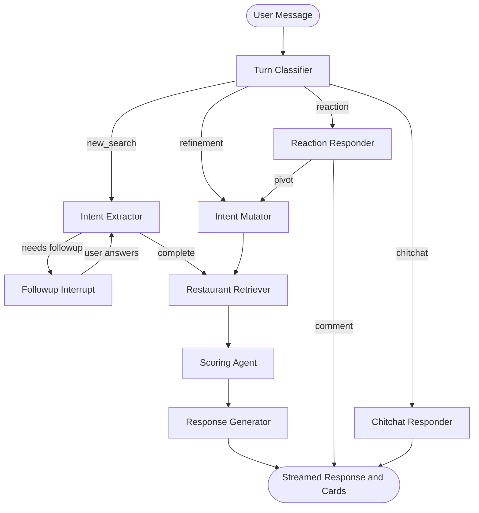
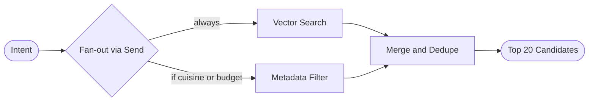

# Taste Toronto

A natural-language restaurant discovery app for the Greater Toronto Area. Ask anything — "cozy Korean date night for 2 under $60", "hidden gem with a patio in Kensington", "family dim sum spot in Scarborough" — and get ranked recommendations with photos, a Google Maps view, and direct links.


---

## How it works

Each message is routed through a multi-agent LangGraph pipeline that classifies intent, retrieves candidates in parallel, reranks with an LLM, and streams the response token-by-token.

### Main graph



### Retriever subgraph (parallel fan-out)



### Pipeline summary

| Step | Agent | What it does |
|---|---|---|
| 1 | **Turn Classifier** | Labels the message: `new_search`, `refinement`, `reaction`, or `chitchat` |
| 2a | **Intent Extractor** | Extracts occasion, group size, budget, cuisine, vibe, dietary, meal type, amenities |
| 2b | **Intent Mutator** | Merges updated filters into existing intent on refinement turns |
| 2c | **Reaction Responder** | Detects pivots ("too expensive") and re-routes; otherwise replies conversationally |
| 2d | **Chitchat Responder** | Handles greetings and off-topic messages warmly |
| 3 | **Restaurant Retriever** | Parallel vector + metadata search via LangGraph `Send()` fan-out; deduplicates top 20 |
| 4 | **Scoring Agent** | LLM reranker selects top 5 with a per-card reasoning sentence |
| 5 | **Response Generator** | Writes a 1–2 sentence honest intro referencing actual returned cuisines |

---

## Features

- **Natural language queries** — any occasion, cuisine, vibe, neighborhood, budget, dietary restriction, or amenity
- **Token-by-token streaming** — response appears word-by-word via SSE; no waiting for the full reply
- **LLM reranking** — GPT-4o-mini scores candidates against the full request context with per-card explanations
- **Parallel hybrid retrieval** — vector search + exact metadata filter run simultaneously and merge results
- **Multi-turn conversation** — liked/disliked restaurants persist across turns; pivots re-search automatically
- **Honest mismatch handling** — if the DB lacks the requested cuisine, the intro says so rather than pretending
- **Restaurant photos** — proxied from Google Places API, cached in-browser
- **Interactive map** — toggleable Google Maps panel with numbered rating markers
- **Google Maps links** — direct place links on every card
- **Autocomplete** — Google Places autocomplete for neighborhood/restaurant search

---

## Tech stack

| Layer | Tech |
|---|---|
| Frontend | Next.js 15, TypeScript, `@vis.gl/react-google-maps` |
| Backend | FastAPI, Python 3.11 |
| AI pipeline | LangGraph, OpenAI GPT-4o-mini, `text-embedding-3-small` |
| Vector search | ChromaDB (persistent, local) |
| Database | SQLite (202 curated Toronto restaurants) |
| Maps & Photos | Google Places API (New), Google Maps JavaScript API |

---

## Project structure

```
Taste Toronto/
├── backend/
│   ├── main.py                      # FastAPI app + SSE streaming + feedback endpoints
│   ├── graph.py                     # LangGraph StateGraph + MemorySaver checkpointer
│   ├── agents/
│   │   ├── turn_classifier.py       # Classifies message type (new_search/refinement/reaction/chitchat)
│   │   ├── intent_extractor.py      # Message → structured intent (with dietary/meal_type/amenities)
│   │   ├── intent_mutator.py        # Merges updated filters on refinement turns
│   │   ├── reaction_responder.py    # Handles reactions; pivots re-route to intent_mutator
│   │   ├── chitchat_responder.py    # Warm replies for greetings and off-topic messages
│   │   ├── restaurant_retriever.py  # Parallel Send() fan-out: vector + metadata filter
│   │   ├── scoring_agent.py         # LLM reranker → top 5 with score_reasoning
│   │   └── response_generator.py    # Writes honest 1-2 sentence intro
│   ├── db/
│   │   ├── models.py                # SQLite schema + migrations
│   │   ├── restaurant_repo.py       # DB queries
│   │   └── chroma_client.py         # ChromaDB client
│   ├── data/
│   │   ├── fetch_restaurants.py     # Seed script: Places API → SQLite + ChromaDB
│   │   ├── reembed.py               # Re-embed all restaurants with richer text
│   │   └── enrich_geo_photo.py      # One-time: add lat/lng + photo_name to DB
│   ├── models/                      # Pydantic models (Intent, RestaurantRecord, etc.)
│   └── services/
│       └── openai_client.py         # OpenAI singleton
│
├── frontend/
│   ├── app/                         # Next.js App Router
│   ├── components/
│   │   ├── ChatShell.tsx            # Main layout + map toggle state
│   │   ├── MessageBubble.tsx        # User/AI message rendering
│   │   ├── RestaurantCard.tsx       # Photo + metadata + score_reasoning callout + links
│   │   ├── MapPanel.tsx             # Google Maps with rating markers
│   │   ├── ChatInput.tsx            # Rotating placeholder input
│   │   ├── FollowUpChips.tsx        # Suggested reply pills
│   │   ├── LocationSearch.tsx       # Neighborhood autocomplete
│   │   └── TypingIndicator.tsx      # Animated dots
│   ├── hooks/
│   │   ├── useChat.ts               # SSE streaming + message state + send/reset
│   │   └── useSession.ts            # UUID session from localStorage
│   └── lib/
│       ├── api.ts                   # Fetch wrappers
│       └── types.ts                 # TypeScript mirrors of Pydantic models
│
├── tests/
│   ├── test_health.py               # Health endpoint
│   ├── test_db.py                   # SQLite + ChromaDB layer
│   ├── test_agents.py               # Each agent node in isolation
│   ├── test_stream.py               # Full SSE pipeline (followup, full-intent, chitchat, multi-turn)
│   └── run_tests.py                 # Sequential test runner with pass/fail summary
│
├── start.bat                        # One-command startup (Windows)
└── .env                             # API keys (not committed)
```

---

## Setup

### Prerequisites

- Python 3.11+
- Node.js 18+
- OpenAI API key
- Google Cloud project with **Places API (New)** and **Maps JavaScript API** enabled

### 1. Clone and configure

```bash
git clone https://github.com/WoodyChang21/Taste-Toronto.git
cd "Taste Toronto"
```

Create `.env` in the project root:

```env
OPENAI_API_KEY=sk-...
GOOGLE_PLACES_API_KEY=AIza...
```

Create `frontend/.env.local`:

```env
NEXT_PUBLIC_GOOGLE_MAPS_KEY=AIza...
```

### 2. Install backend dependencies

```bash
pip install -r backend/requirements.txt
```

### 3. Seed the database

Fetch 202 Toronto restaurants from Google Places, enrich with GPT-4o-mini, and store in SQLite + ChromaDB:

```bash
python -m backend.data.fetch_restaurants
python -m backend.data.enrich_geo_photo
```

Then re-embed with richer text (description + tags + occasions + noise level):

```bash
python -m backend.data.reembed
```

### 4. Install frontend dependencies

```bash
cd frontend
npm install
```

### 5. Start both servers

```bash
# Backend (port 8001)
uvicorn backend.main:app --port 8001

# Frontend (port 3000)
cd frontend
npm run dev
```

Or double-click `start.bat` on Windows (activates the correct environment automatically if updated).

Open [http://localhost:3000](http://localhost:3000).

---

## Running tests

```bash
python tests/run_tests.py
```

Tests cover: health endpoint, SQLite + ChromaDB layer, all agent nodes in isolation, and full SSE streaming pipeline (followup, full-intent, chitchat, multi-turn).

---

## API endpoints

| Method | Path | Description |
|---|---|---|
| `POST` | `/api/chat/stream` | Main SSE streaming chat endpoint |
| `POST` | `/api/feedback` | Record liked/disliked restaurant for a session |
| `GET` | `/api/photo/{id}` | Proxied restaurant photo from Google Places |
| `POST` | `/api/autocomplete` | Google Places autocomplete proxy |
| `GET` | `/api/health` | Health check + restaurant count |
| `DELETE` | `/api/session/{id}` | Clear conversation history |

---

## Data

The database contains 202 curated Toronto restaurants across Downtown, Yorkville, Kensington Market, Distillery District, Leslieville, Scarborough, and North York. Each record includes:

- Name, address, neighborhood, cuisine, price range
- Rating, review count, phone, website, reservation URL
- `semantic_tags` — 20+ descriptors (romantic, hidden_gem, patio, late_night, etc.)
- `occasion_scores` — 0–100 scores for date_night, birthday, family_gathering, hidden_gem
- `description` — 2-3 sentence GPT-4o-mini summary
- `latitude`, `longitude` — for map markers
- `photo_name` — Google Places photo reference

---

## Cost estimate

| Item | Cost |
|---|---|
| DB seeding (one-time, 202 restaurants) | ~$15 |
| Photo + geo enrichment (one-time) | ~$3.50 |
| Re-embedding (one-time, 202 restaurants) | ~$0.05 |
| Per conversation (GPT-4o-mini × 3–4 calls) | ~$0.005 |
| Per conversation (Google Places photo × 5) | ~$0.04 |
| Maps JS API per session | ~$0.007 |

---

## License

MIT
